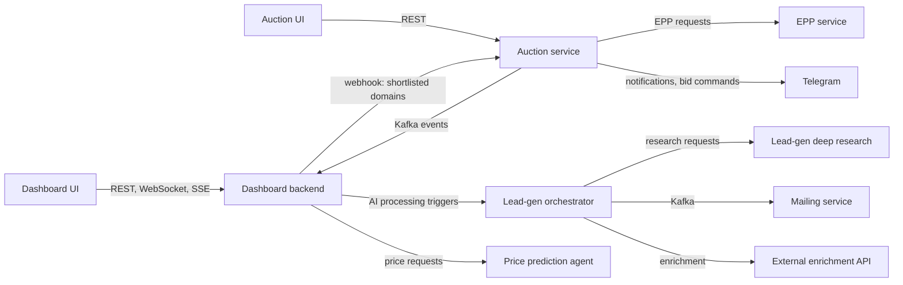

# 09 · Platform Overview

The shortest accurate description of what Namekart runs, written for people who have not seen it yet. Read it on Day 0. Re-read it on Day 10 and notice how much more of it means something.

This document deliberately contains no server names, addresses, credentials, or operational details. You do not need them to learn the system, and you will get what you need for your role when you need it.

---

## 1. What the business does, in engineering terms

Namekart buys, holds, and sells domain names. Engineering exists to do four things well:

1. **Acquire.** Watch domain auctions and expiring-domain drops across many registrars and marketplaces, decide what is worth buying, and bid or register at exactly the right moment.
2. **Understand.** Score and value every domain in a large portfolio and in the market, using data and AI.
3. **Sell.** Find the people and companies most likely to want a given domain, and reach them.
4. **Operate.** Give the team dashboards, workflows, and tools to run all of the above.

Timing is money in the first, data quality is money in the second, and reply rates are money in the third. Keep that in mind when you judge whether a change matters.

### How acquisition actually works

Acquisition is the heart of the business, and it is less simple than "bid on auctions". The full picture, including our registrar rights and bidding strategy, is in [09b-domain-auction-lifecycle.md](09b-domain-auction-lifecycle.md). Read it on Day 0. The essentials:

- **An expiring domain travels a lifecycle:** registrar expired auction, then a descending-price closeout, then pending delete, then deletion, sometimes a registry-run dropzone, then normal registration. It can be bought at several of those points.
- **Later stages are cheaper.** A domain nobody bid on in auction is less contested and can often be taken near the floor price of a later stage.
- **The route is predictable up front** from the registrar, the registry that operates the TLD, the TLD, whether the auction is shared across platforms, and whether we hold registry rights on that TLD.
- **We pursue domains through parallel routes.** Sometimes several sites show one synced auction. Sometimes routes genuinely compete, and only the one that captures the domain charges us.
- **Willingness to pay is not one number.** We set a separate ceiling per stage and route, such as a higher one for the live auction and a lower one for closeout. A proposed ceiling is a **reco**; a finalised one is an **APR**.
- **Never hardcode a platform, TLD, price ladder, or time window.** They all change. Model them as data.

---

## 2. Vocabulary you will hear on day one

| Term | Meaning |
|---|---|
| **Registrar** | A company accredited to register domains (and often to run auctions). We integrate with many. |
| **Auction** | A timed sale of a domain, usually an expired one, on a registrar or marketplace. Has an end time, a current price, and bidders. |
| **Expired auction** | An ascending auction on a registrar's marketplace for a domain whose owner let it lapse. |
| **Closeout** | A descending-price (Dutch) sale that follows an expired auction with no bids. |
| **Pending delete / drop** | The stage before a lapsed domain is deleted, and the deletion itself, after which anyone can register it. |
| **Drop-catch / backorder** | Pre-ordering a domain with a specialist service that races to re-register it the instant it deletes. |
| **Dropzone** | A registry-run descending-price window before a deleted domain becomes generally available. |
| **EPP** | Extensible Provisioning Protocol: the XML-over-TLS protocol registrars use to talk to registries. We use it to capture domains directly in dropzone windows on TLDs where we are a registrar. |
| **Reco / APR** | A proposed price ceiling for a stage or route, and the finalised ceiling the bidding system respects. |
| **LTD** | A domain still being acquired where Sales gathers buyer demand during the live auction, to inform the ceiling. |
| **Shared inventory** | One auction shown on several platforms with synced bids. |
| **Watchlist** | Domains someone wants to track. |
| **Shortlist / acquisition** | Domains the team has decided are worth pursuing, flowing into the bidding process. |
| **Portfolio** | The domains we own. |
| **Appraisal / valuation** | An estimate of what a domain is worth, from rules, comparable sales, and models. |
| **Lead generation** | Finding potential buyers for a domain and enriching their contact data. |
| **Campaign** | An outbound email sequence to those leads. |
| **TLD** | Top-level domain: `.com`, `.ai`, `.io`. |

---

## 3. The services

We are a workspace of many independent services, each in its own repository, each with its own build, Dockerfile, and deployment. There is no monorepo build. Every service has a `CLAUDE.md` at its root; that is the first file to read when you open one.

### Core backends (Java 21, Spring Boot 3, Maven)

| Service | What it does |
|---|---|
| **Auction service** (AMP2) | Monitors auctions across many registrars, places bids, runs the dropzone capture flow, sends Telegram notifications, publishes auction events to Kafka. |
| **Dashboard backend** (NKDashboard) | Portfolio management, acquisition shortlisting, AI domain analysis, internal HR and user management, search. The largest backend. |
| **Lead-gen orchestrator** (ai-worker) | Orchestrates lead generation: calls the research services, enriches contacts, verifies emails, manages campaigns. |
| **Mailing service** | A wrapper around the external email campaign provider. |
| **EPP service** | Speaks EPP to registries for registration and drop capture. |

### Frontends

| App | Stack |
|---|---|
| **Dashboard UI** (nkdashboardui) | Create React App, Material UI, WebSockets and SSE, rich editors, maps. The largest frontend. |
| **Auction UI** (AMP2UI) and the original AMP UI | Create React App, Material UI, Azure AD login. |
| **Marketplace** (nameaiv1) | Next.js 15, Prisma, PostgreSQL, Redis. A full-stack domain marketplace. |
| **name.ai frontend** | Next.js 15, Tailwind. |

### AI and data services (Python)

| Service | Stack and purpose |
|---|---|
| **Lead-gen deep research** | FastAPI and LangGraph; researches potential buyers from three sources in parallel. |
| **Domain processing** | FastAPI pipeline for processing and classifying leads. |
| **Negotiation agent** | LangGraph agent that assists with buyer negotiations. |
| **Price prediction agent** | Predicts domain prices from company names and metrics. |
| **Portfolio valuation advisor** | LangChain-based advisor over the portfolio. |

### Utilities

| Service | Stack and purpose |
|---|---|
| **Scraping service** (NKScrapeMaster) | Node, TypeScript, Puppeteer, Express, MongoDB. Scrapes sources that have no API. |

---

## 4. How they talk to each other



### Kafka topics

The auction service and the dashboard share a vocabulary of events:

| Topic | Meaning |
|---|---|
| `auction_won`, `auction_loss`, `auction_outbid`, `auction_ended`, `auction_updated` | Lifecycle of an auction we are involved in |
| `auction_watchlist` | Watchlist changes |
| `bid_success`, `bid_failure` | Outcome of a bid attempt |
| `scraper_request`, `scraper_response` | Work handed to and returned from scraping |

Learn what each means in business terms before you read the code that produces it.

---

## 5. Data

| Store | Used for | Notes |
|---|---|---|
| **MySQL** | The primary operational database for the Java services | The largest and most important store |
| **PostgreSQL** (self-hosted Supabase) | Newer services: marketplace, name.ai | Supabase adds auth, storage, and row-level security on top |
| **MongoDB** | Audit trails, recordings, scraping output | |
| **Elasticsearch** | Search in the dashboard | Exists because some queries outgrew MySQL |
| **Redis** | Caching, rate limiting, some queues | |

**How the schema evolves.** Several Java services contain a Flyway migrations folder. Do not assume it runs. In the dashboard backend, the Flyway dependency is not wired, so those files never execute; the real mechanism is Hibernate `ddl-auto=update`, in every environment. Always verify per service. This is a known piece of technical debt and a good example of why you check the build, not the folder structure.

---

## 6. Identity

Three identity mechanisms exist across services, for historical reasons:

- **Azure AD (Microsoft) OAuth2**, used by the older React apps through MSAL.
- **Google OAuth2.**
- **A custom company JWT**, issued and validated by our own services.

Which one a service uses is in its security configuration class. Knowing why there are three is part of understanding the system; ask about it in a teach-back.

---

## 7. Configuration

- Java services use Spring profiles: `application.properties` for defaults, `application-dev.properties` for local development, `application-prod.properties` for production.
- In production, configuration and secrets are **injected by the deployment platform** as environment variables or mounted files. They are not meant to live in the repository.
- Values that must change together across many services, such as addresses of shared infrastructure, are defined once as shared variables in the deployment platform and referenced by each service. One change plus a redeploy re-points everything.
- Python and Node services read environment variables, with a committed `.env.example` describing what is expected.

If you ever find something in a repository that looks like a real credential, do not copy it, use it, or test it. Report it to Yash. See [11-security-rules.md](11-security-rules.md).

---

## 8. Build and deployment

- Every service ships as a Docker image, built with a multi-stage Dockerfile.
- Services are deployed with **Coolify**, a self-hosted deployment platform. A push to a watched branch triggers a GitHub webhook; Coolify builds the image and replaces the running container. There is no separate CI pipeline doing the deploy.
- **Cloudflare** sits in front of public services for DNS, TLS, and caching.
- Servers are reachable by engineers only over a **private mesh VPN** tied to each person's identity. There is no public SSH.

Practical consequence: know which branch of a service is watched before you push to it. Pushing to that branch is deploying to production.

---

## 9. Observability

You get read-only access to this after Day 8. Until then, you rebuild a small version of it in your teaching project (L8).

### What a service gets, and what it must do

| Signal | Where it lands | What the service must do |
|---|---|---|
| **Logs** | Loki, viewed in Grafana | Nothing beyond logging to stdout. Every container's output is shipped automatically. Log structured JSON. |
| **Metrics** | Prometheus, viewed in Grafana | Expose a metrics endpoint and add one opt-in environment variable in the deployment platform: `NK_OBSERVE` for Spring Actuator's Prometheus endpoint, `NK_OBSERVE_METRICS` for a plain `/metrics` endpoint. Scraping is registered automatically. |
| **Traces** | Tempo, viewed in Grafana | Add the tracing SDK (Micrometer Tracing for Spring, OpenTelemetry for others) and the standard OTLP environment variables. |

### The failure archetypes

Do not try to make every service export the same metrics. Standardise the **failure you are detecting**, not the metric. Every job fits two or three of these:

| Archetype | Question it answers | Metric shape |
|---|---|---|
| **Liveness** | Is the process there? | `up`, free from scraping |
| **Freshness** | Did the thing that should happen, happen? | `*_last_success_timestamp_seconds` |
| **Volume** | Did it process a plausible amount? | `*_processed_total` with a floor |
| **Error rate** | What fraction is failing? | `*_errors_total` over `*_total` |
| **Saturation** | Is it backing up? | Queue depth, consumer lag |
| **Dependency** | Can it reach what it needs? | `*_dependency_up{dependency="..."}` |
| **Invariant** | Is a business rule still true? | A custom gauge |

When you add a service, ask which archetypes apply and export those.

### Naming contract

- Metric names are `<service>_<subject>_<unit>`, for example `nkdash_sync_last_success_timestamp_seconds`.
- Suffixes follow Prometheus convention: `_total` for counters, `_seconds`, `_bytes`, `_timestamp_seconds`, `_ratio`.
- Every alert rule carries a `service` label and a `severity` label. `component` is recommended. Routing matches only on `service` and `severity`, so a service that follows the contract needs no routing changes.

### Export the expectation alongside the observation

Different jobs run at different cadences. Instead of one hand-tuned rule per job, each job exports how often it is expected to succeed:

```
job_last_success_age_seconds{job="closeout"}      7350
job_expected_interval_seconds{job="closeout"}     7200
```

One rule then covers every job, forever:

```promql
max by (service, job) (
  job_last_success_age_seconds / job_expected_interval_seconds
) > 3
```

A new job needs no rule change; its expectation is data, not configuration. Apply the same idea to any threshold that varies per job. It is the single most reusable idea in our observability approach.

### Severity ladder

| Severity | Meaning | Example |
|---|---|---|
| `critical` | User-visible now, or data being lost. Interrupt a person. | Scheduled work has not succeeded for three times its interval |
| `warning` | Degraded; becomes critical if ignored. Business hours. | Error rate elevated; one lane of work skipped |
| `info` | Worth knowing, never a push. | A daily job slower than usual |

Everything at one severity trains people to ignore all of it. If you cannot decide, it is `warning`.

---

## 10. Where the platform is going

The company is building a **Domain Intelligence Platform**: a data platform that ingests domain, market, and company data; a set of intelligence engines that score, value, and match domains; an API over those engines; and a portfolio intelligence dashboard on top. Many of the Python services above are early pieces of it.

Practical consequence for you: new projects in the coming months are likely to be data pipelines, scoring engines, and AI services with evaluation, not only CRUD features. The mental models on data, messaging, AI systems, and observability are the ones that will pay off most.
