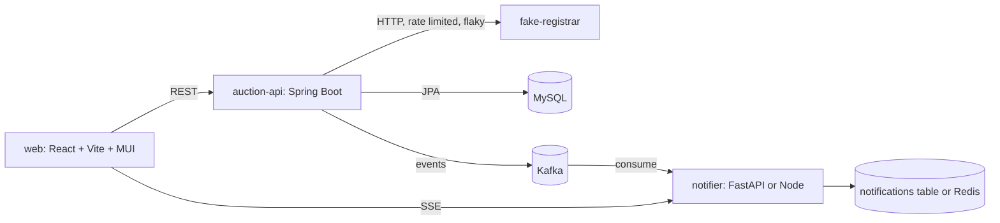

# 10 · The Teaching Project: Mini AMP

For the first two weeks you do not run any company service. You build a small version of one.

**Mini AMP** is a miniature domain auction platform: domains, auctions from a fake registrar, bids, a watchlist, a shortlist, events on Kafka, a notification service in a second language, and a live web page. It uses the same vocabulary and the same kinds of problems as our real auction service and dashboard, at a size one person can build and fully understand.

Every "run" lab in [03-labs.md](03-labs.md) runs on it. Every section of [04-spring-for-node-and-python-devs.md](04-spring-for-node-and-python-devs.md) adds one milestone to it. On Day 10 you demo it.

It is also yours to keep improving after the two weeks: every stretch goal at the end is a real engineering problem we face.

---

## 1. Ground rules

- **Your own private GitHub repository**, named `mini-amp-<your-name>`, with Yash and your buddy added as collaborators.
- **No company code copied in.** Reading our repositories to learn conventions is encouraged. Pasting from them is not.
- **No real credentials, no real registrars, no real money.** Everything external is faked by you.
- **Work through pull requests on your own repository.** One milestone, one pull request, with a description a reviewer can verify without asking you. Your buddy reviews. Merge after review. This is practice for week 3.
- **Keep a `DEVLOG.md`.** One short paragraph per milestone: what you built, what surprised you, what you would do differently.
- **Keep the `README.md` runnable.** Anyone should be able to clone and start everything with one Compose command and the instructions in the README. If your buddy cannot run it from the README, the milestone is not done.

---

## 2. Architecture

| Component | Stack | Why it exists |
|---|---|---|
| `auction-api` | Java 21, Spring Boot 3, Maven | The core. This is where you learn Spring. |
| `fake-registrar` | Any language, about 150 lines | Simulates an external registrar with realistic bad behaviour, so you learn timeouts, retries, and rate limits against something that fights back. |
| `notifier` | **The language of FastAPI or Node that you are weaker in** | Consumes events and pushes them to the browser. Forces a second stack and a second event-loop model. |
| `web` | React, Vite, Material UI | Auction list, watchlist, bid form, live notification feed. Keep it small; it is not the point. |
| Infrastructure | Docker Compose: MySQL 8, Kafka in KRaft mode, a Kafka UI; later Prometheus and Grafana | Everything starts with one command. |

### The fake registrar's behaviour

Build it to misbehave on purpose, with each behaviour switchable by an environment variable:

- Serves a list of auctions with end times a few minutes in the future, and a new batch every few minutes.
- Accepts bids and responds with accepted, rejected (too low), or outbid.
- **Latency:** random 50 to 800 ms per request.
- **Errors:** about 5 percent of requests return HTTP 500.
- **Rate limit:** more than a set number of requests in a short window gets you blocked for a while. When blocked, it responds with **HTTP 200 and a body saying the IP is blocked**, not a 429. Real registrars do this. Your client must detect it.
- **Clock:** it can be configured to report times with an offset, so you must decide whose clock is right.

---

## 3. Data model

Start with this and change it when you have a reason. Store all times in UTC.

| Entity | Fields | Relationships |
|---|---|---|
| `Domain` | id, name (unique), tld, length, created_at | One `DomainProfile`; many `Auction`s |
| `DomainProfile` | id, notes, estimated_value, updated_at | **One-to-one** with `Domain` |
| `Registrar` | id, name, base_url | Many `Auction`s |
| `Auction` | id, external_id, current_price, min_increment, ends_at, status (OPEN, ENDED, WON, LOST), version | **Many-to-one** `Domain` and `Registrar`; **one-to-many** `Bid` |
| `Bid` | id, amount, placed_at, status (PENDING, SUCCEEDED, FAILED, OUTBID), idempotency_key (unique) | **Many-to-one** `Auction` and `AppUser` |
| `AppUser` | id, email, role (ADMIN, BIDDER, VIEWER) | **Many-to-many** `Domain` through a watchlist join table; **one-to-many** `ShortlistEntry` |
| `ShortlistEntry` | id, reason, created_at | **Many-to-one** `Domain` and `AppUser` |

### Events

| Topic | Key | When |
|---|---|---|
| `auction_updated` | auction id | Price or status changed during sync |
| `auction_ended` | auction id | An auction passed its end time |
| `bid_success` | auction id | The registrar accepted a bid |
| `bid_failure` | auction id | The registrar rejected a bid, or the call failed |
| `auction_outbid` | auction id | Someone else is now winning |
| `auction_watchlist` | user id | A watchlist changed |

Every event payload carries an event id, an event type, a schema version, the time it happened in UTC, and the entity ids. Decide the partition key deliberately and write down why.

---

## 4. Milestones

Each milestone is one pull request. The Spring section and labs it pairs with are listed. Days assume the default schedule in [02-two-week-schedule.md](02-two-week-schedule.md).

### P0 · Skeleton (Day 1)

- Repository, README, DEVLOG, `.gitignore`, `.env.example`.
- Compose file with MySQL, Kafka, and a Kafka UI, all healthy.
- A Spring Boot 3 project generated from Spring Initializr with web, data-jpa, validation, actuator, and the MySQL driver. It starts, connects to MySQL, and answers its health endpoint.
- **Done when:** your buddy clones it and gets a healthy health endpoint using only the README.

### P1 · Java warm-up (Day 2, Spring section 1)

- A small command-line mode or separate module that reads a JSON file of a few thousand domains into records, filters and groups them, and prints statistics.
- **Done when:** it runs from the command line through Maven, not only from the IDE.

### P2 · Structure (Day 3, section 2)

- Package layout by feature or by layer, chosen and justified in the DEVLOG.
- Constructor injection only. Typed configuration with `@ConfigurationProperties` records for the registrar settings.
- **Done when:** you can draw the bean graph of the application from memory.

### P3 · The web layer (Day 4, section 3)

- CRUD endpoints for domains and auctions with request validation, pagination, and one global exception handler returning `ProblemDetail` bodies.
- **Done when:** invalid input returns a consistent, useful 400 on every endpoint, and a missing resource returns a consistent 404.

### P4 · Persistence (Day 5, section 4, with L5)

- Entities and repositories for the model above, minus relationships you have not reached yet.
- A seeding command that loads tens of thousands of auctions and bids.
- SQL logging on. At least one N+1 found and fixed, and at least one index added with plans before and after.
- **Done when:** L5 is written up against this data.

### P5 · Relationships and transactions (Day 6, section 5, with L4)

- Watchlist many-to-many, profile one-to-one, shortlist one-to-many, with deliberate choices about cascade and orphan removal.
- **Place a bid** as a single transactional service method: validate against the current price, insert the bid, update the auction. Use optimistic locking on `Auction` so that two concurrent bids cannot both win.
- A test that proves a rolled-back bid leaves no partial state.
- **Done when:** L4 is written up, and you can explain what happens when two users bid at the same instant.

### P6 · The outside world (Day 7, section 6, with L7)

- A client for the fake registrar. Build it twice, once with Feign and once with `RestTemplate` or `RestClient`, and keep the one you prefer. Explicit connect and read timeouts. Retries with backoff only for safe, idempotent reads. Detection of the "blocked" response that arrives as HTTP 200.
- A scheduled sync that pulls auctions every minute and cannot overlap with itself.
- `@Cacheable` on the registrar list, with a deliberate expiry.
- A multi-stage Dockerfile for `auction-api`, added to Compose.
- **Done when:** the sync survives the fake registrar's latency, errors, and rate limit without crashing or hammering it, and L7 is written up.

### P7 · Concurrency (Day 8, section 7, with L10)

- **Closing sprint:** a job that, a few seconds before each auction's end, places final bids on all auctions ending in the next minute **concurrently**, using `CompletableFuture` on a bounded executor, within a shared total budget.
- Demonstrate the race on the shared budget first, then fix it. Compare a platform-thread executor with virtual threads.
- **Done when:** L10 is written up and the budget can never be exceeded, proved by a test that runs the sprint many times.

### P8 · Security, events, and live updates (Day 9, section 8, with L8, building on L9 from Day 7)

- JWT-based authentication with the three roles. Only BIDDER and ADMIN can bid; only ADMIN can manage registrars. Use method-level authorisation.
- Publish the events above from `auction-api`.
- Build `notifier` in your weaker of FastAPI or Node: consume events with a consumer group, store notifications **idempotently** by event id, and stream them to the browser over SSE.
- The web page shows auctions, lets a BIDDER bid, and shows notifications live.
- Metrics and structured logs for `auction-api` following the platform naming contract; Prometheus and Grafana added to Compose with one dashboard.
- **Done when:** you can kill `notifier`, place bids, restart it, and see every notification exactly once. L8 and L9 are written up.

### P9 · Tests and polish (Day 10, section 9)

- Controller slice tests, a repository test against real MySQL with Testcontainers, a test for the event payload shape shared with `notifier`, and the concurrency test from P7.
- README complete. DEVLOG complete.
- **Done when:** a clean clone runs all tests and the whole system with the README alone.

---

## 5. The Day 10 demo

Fifteen minutes, live, in the office. Follow this script so demos are comparable:

1. Clone-to-running: show the README command bringing everything up.
2. The fake registrar publishes a new batch; the sync picks it up; the auction appears on the page.
3. A VIEWER tries to bid and is refused. A BIDDER watchlists the domain and bids. The bid event shows up in the Kafka UI and as a live notification.
4. Turn on the fake registrar's rate limit and 500s. Show the sync degrading gracefully in logs and on your Grafana panel.
5. Kill `notifier`. Bid twice. Restart it. Show that both notifications arrive, once each.
6. Run the closing sprint against many auctions and show the budget held.
7. One thing you would redesign, and why.

Your buddy or Yash then runs the incident drill from L12 on your system while the group watches you diagnose it.

---

## 6. Stretch goals

For when you are ahead, or after the two weeks. Each one is a real problem we have.

- **Transactional outbox.** Events are currently published after the database commit; a crash between the two loses an event. Fix it properly.
- **Keyset pagination** on the auction list, and a measurement showing why it matters at a million rows.
- **Search.** Add Elasticsearch or PostgreSQL full-text search for domains, with a sync from MySQL, and reason about consistency.
- **Appraisal with an LLM.** Add a step in `notifier` or a new Python service that estimates a domain's value with a model, with structured output, a cost cap per day, a cache, and a small evaluation set.
- **Leader election.** Run two replicas of `auction-api` and make sure the sync and the closing sprint run exactly once.
- **Clock discipline.** Make the fake registrar's clock skewed and make the closing sprint correct anyway.
- **The real lifecycle.** Using [09b-domain-auction-lifecycle.md](09b-domain-auction-lifecycle.md), give the fake registrar a closeout ladder for auctions that end without bids and a daily dropzone window. Replace the single bid limit with per-stage ceilings that keep the NULL, zero, and positive distinction, and model them as `(domain, route, ceiling, timing)` rows rather than columns.
- **Load test.** Find the first thing that breaks at a hundred concurrent bidders, fix it, and write it up with numbers.
- **Deployability.** Make every service configurable entirely through environment variables with health and readiness endpoints, so it could be deployed on our platform unchanged.
